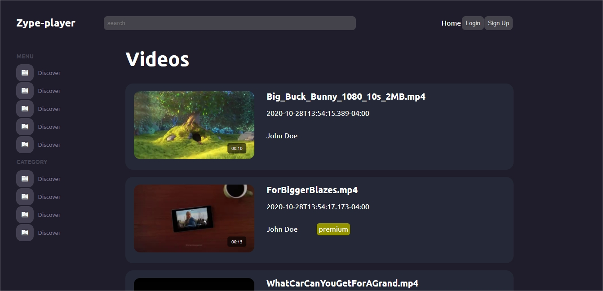
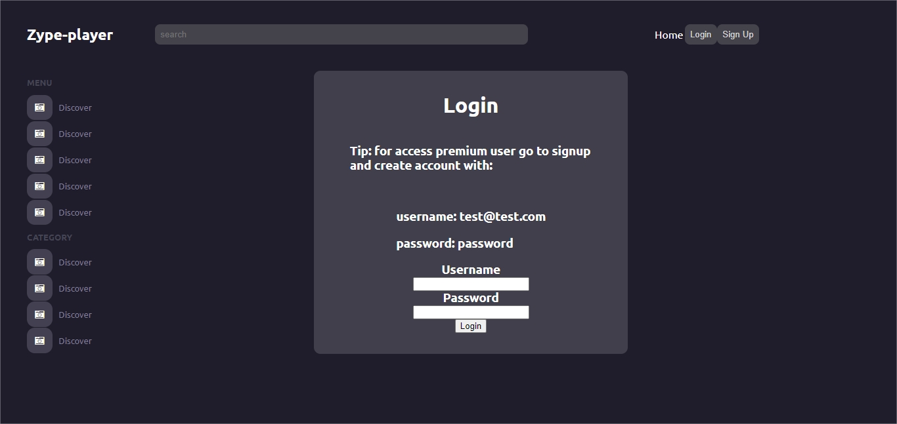
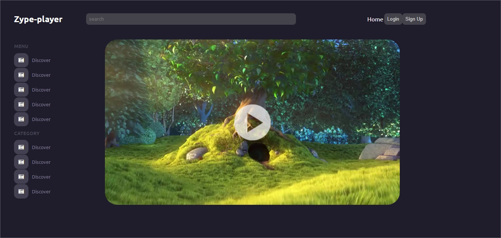
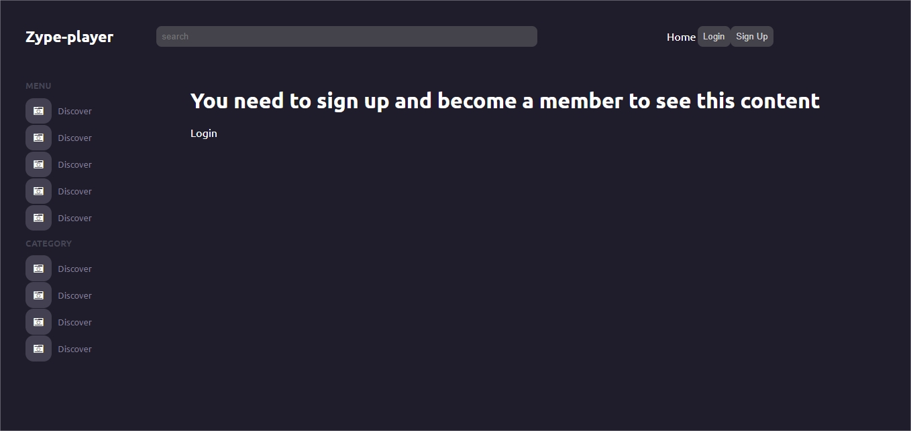

# Zype video app (Homework)

a. Explain how the site will function from a broad level. Describe the architecture of
the app and how it will communicate with Zype's API.

- I have created a service folder that contains a file called ZypeAPi.rb. This one is a class that has methods that call the required API endpoints.

- This class is connected to Users, Sessions, and videos controllers. In users, the API endpoint is being called to authenticate the user, obtaining the access token for displaying premium videos and saving the above-mentioned token into the session cookie.

b. Give an overview of the models and controllers. Describe where various portions
of the functionality and logic will be. You can use diagrams if you would like.

- In sessions controller is being called the API auth endpoint and saving the access token into a session cookie. I am managing also the login user sessions.

- In the videos controller, the "list" API endpoint is being called for displaying all the videos from newest to oldest.

- In User controller I am calling the same API endpoint from sessions for once a user is created I could persist the access token into my session cookie.

- I have created a model and migration table for users for validating data and creating new users (all new users are non-premium-members, except test@test.com user),

## [Live version](https://zype-members.herokuapp.com/)

 
 
 

### Aditional gems

- gem "font-awesome-rails" (for icons)
- faraday (for api calls, but at the end i used the suggested call from zype api)

### Install in Your local Machine

Use your terminal and run the commands after each instruction.

| Command                                             | Description                                           |
| --------------------------------------------------- | ----------------------------------------------------- |
| `git clone https://github.com/nicolasmarino99/zype-members.git` | Clone the repository to you computer                  |
| `cd zype-members`                                          | Navigate to the newly created folder                  |
| `rails db:migrate`                                       | migrate database  |
| `rails s`                                         | starts the development server     |
|                                                     | Press `Ctrl + c` to kill **http-server** process      |
| `http://localhost:3000`                             | Visit this link check the site                      |

## Author

:man: **Nicolás Mariño Parra**

- Github: [@nicolasmarino99](https://github.com/nicolasmarino99)
- Twitter: [@nicolasmarino99](https://twitter.com/nicolasmarino99)
- Linkedin: [Nicolás Mariño Parra](https://www.linkedin.com/in/nicol%C3%A1s-mari%C3%B1o-parra-45a707177/)

## 🤝 Contributing

Contributions, issues and feature requests are welcome!

Feel free to check the [issues page](https://github.com/nicolasmarino99/Phoom.git/issues).

1. Fork it (https://github.com/nicolasmarino99/frontend-body-tr.git/fork)
2. Create your feature branch (git checkout -b my-new-feature)
3. Commit your changes (git commit -am 'Add some feature')
4. Push to the branch (git push origin my-new-feature)
5. Create a new Pull Request

